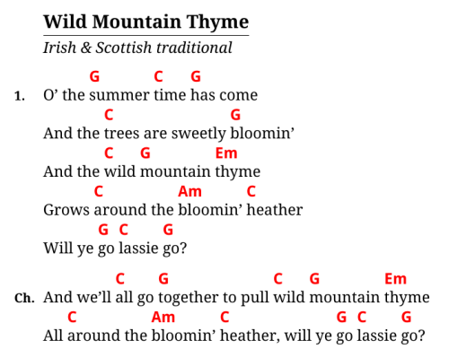

# bard

[](https://travis-ci.com/vojtechkral/bard) [](https://crates.io/crates/bard)

Markdown → songbooks.

_bard_ is a songbook compiler that reads Markdown files and produces songbooks in PDF, HTML, and [Hovorka](http://karel-hovorka.eu/zpevnik/).

_bard_ reads files like this:

```Markdown
# Wild Mountain Thyme
## Irish & Scottish traditional

1. Oh the `G`summer `C`time `G`has come
And the `C`trees are sweetly `G`bloomin'
And the `C`wild `G`mountain `Em`thyme
Grows `C`around the `Am`bloomin' `C`heather
Will ye `G`go `C`lassie `G`go?

> And we'll `C`all go `G`together to pull `C`wild `G`mountain `Em`thyme
All `C`around the `Am`bloomin' `C`heather, will ye `G`go `C`lassie `G`go?
```

... and creates output like this:



Check out the [Example PDF](https://raw.githubusercontent.com/vojtechkral/bard/main/example/output/songbook.pdf)
and the [Example project](./example).

## Features

- _bard_ is project-oriented: A single [`bard.toml` file](./doc/bard.toml.md) defines inputs, outputs and
  configuration options, similar to how many static site generators work.
- Easy to use [input format](./doc/markdown.md), you probably already understand it.
- Output formats:
    - PDF via TeX
    - HTML
    - [Hovorka XML](http://karel-hovorka.eu/zpevnik/)
    - JSON (for machine processing)
- [Transposition and notation conversion](./doc/transposition.md)
    - Optionally with a secondary chord set
- [Templating](./doc/templates.md): Outputs are fully customizable with [Handlebars](https://handlebarsjs.com/) templates.

## Installation

- On Arch Linux: [via AUR](https://aur.archlinux.org/packages/bard/).
- On Windows: Download prebuilt binary from the [Releases page](https://github.com/vojtechkral/bard/releases).
- On any OS with a [Rust toolchain](https://rustup.rs/): Use `cargo install -f bard` .

Packages for more OSes are hopefully Coming Soon™.

Additionally, to generate PDFs a TeX engine is needed.
Recommended options are:
- The `xelatex` compiler from _TeX Live_, available on most Linux OSes.
- [Tectonic](https://tectonic-typesetting.github.io/en-US/), available on several UNIX OSes,
  recently there's an early support for Windows as well (see [their CI releases](https://github.com/tectonic-typesetting/tectonic/releases/tag/continuous)).
- [MiKTeX](https://miktex.org/) for Windows.

A word of warning: bard's Windows support is largely untested so far.

## Usage

To start a new songbook project, create a new directory, navigate in it with a command line and type:

    bard init

This will create a skeleton project with a `bard.toml` file and a `songs` subdirectory with one example Markdown song file.

To compile the project and generate output files type:

    bard make

While editing the `bard.toml` file or song source files, it would become annoying to have to type `bard make` every time there's a change. For this reason there's another command:

    bard watch

... which will make _bard_ run continuously, watching for changes in sources files.
It will then re-compile the songbook every time there's a change. Use `Ctrl` + `C` to stop it.

## FAQ

#### Why is the default TeX template done the way it is?

The default layout is optimized for songbooks that are fairly portable (A5 format)
and yet offer hopefully fairly good legibility at that size. They are meant to handle
travel and outdoor situations as well as possible.
This is why the font is fairly large, the chords in bold and color,
and generally the page real estate tends to be used as much as possible.

I've tried reading a songbook illuminated only by a campfire or a half-working flashlight
over someone's shoulder way too many times to tolerate small fonts and mostly empty pages.

#### Was this software developed with <3 ?

As a matter of fact, yes, this tool was made by less than three
developers. It's really just me so far.
