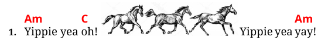
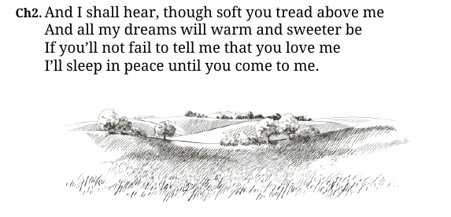
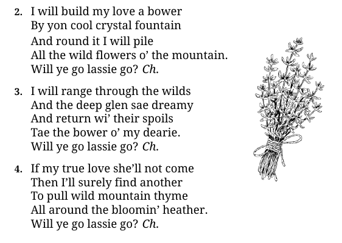

# Images

The Markdown image element is supported in bard. The image path is relative to the `output` directory.
For example, if we put a file named `horses.jpg` in the `output` directory, we can use it like this:

```md
1. `Am`Yippie yea `C`oh!  Yippie yea `Am`yay!
```

which renders as:



By default, the image renders inline within text at the position of the image element.

Please note that while bard supports displaying images, the flexibility of features will never be as good as with hand-crafted documents.
There are limitations imposed by Markdown as well as output formats.

### Centered and floating images

Markdown allows an additional parameter, a 'title', to be specified after the image path in double quotes.
In bard this parameter is used to specify image position class, the syntax is as follows:

```md

```

Two classes are supported by bard's default templates:

- `"center"`: the image is centered on the page with text above and below, and
- `"right"`: the image floats on the right side of the page with text flowing left to it.

From the example project:

```md
>> And I shall hear, though soft you tread above me
And all my dreams will warm and sweeter be
If you’ll not fail to tell me that you love me
I’ll sleep in peace until you come to me.


```

renders as:



and

```md
2. I will build my love a bower
By yon cool crystal fountain 
And round it I will pile
All the wild flowers o' the mountain.
Will ye go lassie go? !>

(...)
```

renders as:



### DPI settings

In PDF, the DPI setting governs the relationship between image size in pixels and it's physical size when printed.
DPI is configured with the `dpi` property in the `output` section whose value is a numeral in units of pixels per inch.\
If not configured, the default of 144 pixels per inch is used.

In HTML, there is no concept of DPI as such, instead, the `dpi` field is used as a scaling factor by which the image dimensions
are multiplied when HTML image elements are rendered &ndash; for example, the value of 0.5 would halve the dimensions.\
The default is 1, ie. no scaling applied.

Example of custom DPI settings:

```toml
[[output]]
file = "songbook.pdf"
dpi = 192

[[output]]
file = "songbook.html"
dpi = 0.75
```
