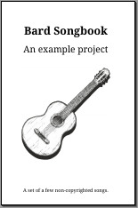

# Introduction

**bard** is a command-line tool that generates songbooks from Markdown sources.

In this book, you should find information how to:

- [Install bard](./install.md)
- [Setup a new project](./project.md)
- [Write songs using Markdown](./songs.md)

... and more.

## Example

Check out the example songbook to get a feel for what the output looks like:

<table><tr>
<td><a href="./assets/songbook.pdf" target="_blank">PDF </td>
<td><a href="./assets/songbook.html" target="_blank">HTML </td>
</tr></table>

The sources for the example project can be <a href="https://github.com/vojtechkral/bard/tree/main/example" target="_blank">found here</a>.

## About The Project

The purpose of bard is to make it quick & easy to create songbooks for people to sing & play from around campfires, in jam sessions and similar.
It is a non-profit open-source project.

The source code is licensed under the [Apache 2.0 License](https://www.apache.org/licenses/LICENSE-2.0.html) ([TL;DR](https://choosealicense.com/licenses/apache-2.0/)). Default fonts used are [Droid](https://en.wikipedia.org/wiki/Droid_(typeface)) and [Noto](https://en.wikipedia.org/wiki/Noto_fonts), under the Apache license.

Development happens in the open [at GitHub](https://github.com/vojtechkral/bard/).

### Contributors

bard was created by [Vojtěch Král](https://github.com/vojtechkral) with inspiration and help from .

Code contributors: 

Many thanks to the wonderful community at [TeX Stack Exchange](https://tex.stackexchange.com/) for always being there to help out with TeX issues.

Website front image by [Joris Voeten](https://unsplash.com/@jorisoi).
