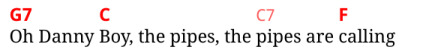
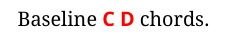
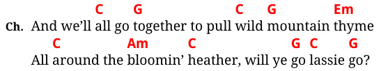
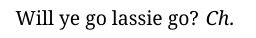
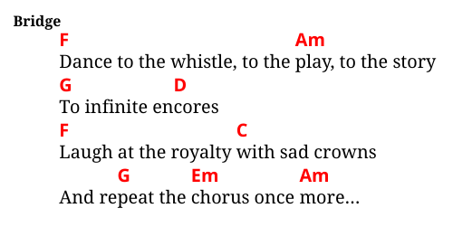

# Writing Songs

Typically a song source looks something like this:

```md
# Wild Mountain Thyme
## Irish & Scottish traditional

1. O the `G`summer `C`time `G`has come
And the `C`trees are sweetly `G`bloomin'
And the `C`wild `G`mountain `Em`thyme
Grows `C`around the `Am`bloomin' `C`heather
Will ye `G`go `C`lassie `G`go?
```

The header `# Wild Mountain Thyme` is the title of the song.
All content following the header is considered part of that song
until either the end of the file or a new H1 title (there may be multiple songs in one file).

The `## Irish & Scottish traditional` is a subtitle. In the output, it appears underneath
the main title in a smaller font. This is optional. There may also be several subtitles.

### Lyrics and Chords

After the title, the first verse follows:

```md
1. O the `G`summer `C`time `G`has come
And the `C`trees are sweetly `G`bloomin'
...
```

The chords are delimited with backticks (`` ` ``) and inline within the lyrics.
In the output, each chord will appear exactly above the text that follows it.
Chords may be placed anywhere within the lyrics, including in the middle of a word or above a space or punctuation.

A chord span may contain multiple chords separated by spaces or other punctuation.

Chords may also be delimited with double backticks like this:

```md
`G7`Oh Danny `C`Boy, the pipes, the ``C7``pipes are `F`calling
```

This indicates that the chord can be skipped if the player
has trouble playing it. It is rendered in a thinner font in the output:



Finally, chords can be placed on the baseline of the text next to lyrics rather than above them.
This is done by appending an underscore (`_`) after a chord or between several chords:

```md
Baseline `C_D` chords.
```



This can be useful when writing chords for instrumental parts such as intros, solos or similar.
See also the custom verse type below.

##### Paragraphs and whitespace

The lyrics can be divided into multiple paragraphs as part of one verse
using a blank line.

Unlike in regular Markdown, line breaks are preserved &ndash; they are the same in the output as in the input.
The text isn't automatically wrapped.

##### Punctuation

By default, some punctuation such as `'`, `"`, or `...` is converted to Unicode characters in a 'smart' way (e.g., pairing up quotes).
For example, `'Hello' "world" ...` is rendered as  `‘Hello’ “world” …`.

This can be turned off in `bard.toml` top section using:

```toml
smart_punctuation = false
```

### Verses

The `1.` in the above lyrics starts the first verse. Technically this is a Markdown ordered list.
Just like in Markdown, the numbers don't need to ascend in the correct order. In fact, you can number
every verse as `1.` and they will be correctly numbered in the output.

Numbered verses are considered "regular" verses. There are two more verse types.

##### Choruses

A chorus is started using the `>` syntax. This is the Markdown block quote element.
For example:

```md
> And we'll `C`all go `G`together to pull `C`wild `G`mountain `Em`thyme
All `C`around the `Am`bloomin' `C`heather, will ye `G`go `C`lassie `G`go?
```

The label used for choruses in the output is configured with the `chorus_label` property in the `[book]` section of `bard.toml`.
The default chorus label is "Ch". The above renders as:



If a song contains more than one chorus, use the `>>` syntax to start the second one, `>>>` for the third, etc.

Choruses can be referenced from anywhere in text using the `!>` extension syntax.
The `!>` mark is replaced with `chorus_label` when rendering.
`!>` references the first chorus, `!>>` the second one, etc. For example:

```md
Will ye go lassie go? !>
```

will render as:



##### Special verses

Finally, a verse can be labelled with any label of your choosing using the H3 syntax:

```md
### Intro
`Am_F_C_F_C_G`
```


or:

```md
### Bridge
\
`F`Dance to the whistle, to the `Am`play, to the story
`G`To infinite en`D`cores
`F`Laugh at the royalty `C`with sad crowns
And re`G`peat the `Em`chorus once `Am`more...
```



The `\` on a line is used to add a new line after the verse title.
By default, the lyrics follow on the same line as the title.

### Other Markdown Elements

These rich text Markdown elements are supported:

- Italics,
- bold text, and
- hyperlinks.

However, these are only supported in paragraph text, not in other elements such as headings.

These additional block Markdown elements are supported:

- Bullet lists,
- horizontal rules, and
- preformatted text blocks.

However, only flat structure is supported &ndash; nested lists are ignored.

Bard does not support inline HTML in Markdown. At least not as such; inline HTML is instead used for [syntax extensions](extensions.md).

### Markdown Standard

Except for the limitations and extensions listed above, Bard interprets Markdown according to the [CommonMark](https://commonmark.org/) standard.
