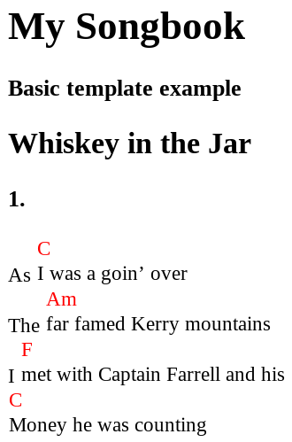

# Templates

bard uses templates to render HTML files and PDF files through TeX. This is by default invisible to the user, but in fact, the templates are entirely customizable.

To obtain the default template for an output, specify a template path in `bard.toml`:

```toml
[[output]]
file = "songbook.pdf"
template = "pdf.hbs"

[[output]]
file = "songbook.html"
template = "html.hbs"
```

... and then run `bard make`. bard will create the template files containing default templates for PDF (TeX) and HTML formats.

bard uses the [Handlebars](https://handlebarsjs.com/) template language, hence the extension `.hbs`.

### The AST

When rendering, bard passes the entire songbook AST (abstract syntax tree) to the template as JSON objects. Most notable are the `book` and `songs` objects:

- `book` is a copy of the `[book]` section in `bard.toml` and contains the book's main title, subtitle and other metadata.
- `songs` is an array of all the songs in the same order as loaded from the files. Each song object contains a title, subtitles (if any), and an array of _blocks_ which make up the content of the song. There are several types of blocks, some of which may contain _inlines_. There are in turn several types of inlines, such as chords, lyrics, etc.

As an example, you can refer to the [AST for the example songbook](https://github.com/vojtechkral/bard/blob/main/example/output/songbook.json). You can also export the AST of your songbook in JSON format &ndash; see the [JSON and XML](./json-and-xml.md) chapter. Finally, there is the [all-features](https://github.com/vojtechkral/bard/tree/main/tests/test-projects/all-features) test project whose [exported AST](https://github.com/vojtechkral/bard/blob/main/tests/test-projects/all-features/output/songbook.json) should contain all the possible elements.

The format of the AST is versioned to guard against incompatibilities. The AST will not change in an incompatible
way between bard releases of the same major number.

Because of this, bard templates start with a [version check](#version_check-version) call.

### Basic structure and _Inline Partials_

At the most basic level, the purpose of the template is to loop through the `songs` array and render each song. A very simple HTML template might look like this:

```html
{{~ version_check "1.1.0" ~}}
<html>
<body>
  <h1>{{ book.title }}</h1>
  {{#if book.subtitle }}<h3>{{ book.subtitle }}</h3>{{/if }}

  {{#each songs}}
    <h2>{{ title }}</h2>

    <div>
      {{#each blocks}}{{> (lookup this "type") }}{{/each}}
    </div>
  {{/each}}
</body>
</html>
```

Rendering with this template will render a HTML file only containing song titles. To render the content, bard templates make a heavy use of
Handlebars' [inline partials](https://handlebarsjs.com/guide/partials.html#inline-partials) to define how various elements are displayed.
The `{{#each blocks}} ... {{/each}}` syntax loops through the blocks of the current song. The `{{> (lookup this "type") }}` incantation reads the `type` field of the block and dispatches to a handlebars partial of that name.

The most important block type is the verse type, named `b-verse` (the `b-` prefix is for _block_). Let's define a partial to render a verse:

```html
{{#*inline "b-verse"}}
  <h3>
    {{~#with label}}
      {{~#if verse}}{{verse}}.{{/if}}
      {{~#if (contains this "chorus")}}{{@root.book.chorus_label}}{{chorus}}.{{/if}}
      {{~#if custom}}{{custom}}{{/if}}
    {{~/with~}}
  </h3>

  {{~#each paragraphs~}}
    {{#each this}}{{> (lookup this "type") }}{{/each}}
  {{~/each~}}
{{/inline}}
```

First, the verse label is rendered &ndash; there are three label types, each is accounted for. Then, the code loops through `paragraphs`, which is an array of arrays of inlines. Each array of inlines is looped through with the `{{#each this}}{{> (lookup this "type") }}{{/each}}` line. Each inline is dispatched to a partial in the same way that blocks are dispatched by reading the `type` field and calling a partial of that name.

We're going to implement inlines `i-text`, `i-break`, and `i-chord`. The partials for `i-text` and `i-break` will be very simple:

```html
{{#*inline "i-text"}}{{ text }}{{/inline}}
{{#*inline "i-break"}}<br>{{/inline}}
```

The partial for `i-chord`:

```html
{{#*inline "i-chord"~}}
<table style="display: inline-table; vertical-align: bottom; border-collapse: collapse;">
  <tr><td style="color: red">{{ chord }}</td></tr>
  <tr><td>{{#each inlines}}{{> (lookup this "type") }}{{/each}}</td></tr>
</table>
{{~/inline}}
```
The chord again contains inlines in a recursive way (although it is guaranteed never to contain another chord). This way, the text contained within an `i-chord` type will be dispatched to the `i-text` inline just like from `b-verse` directly.

With these in place, a very basic template should be complete. You can download the [whole source code](assets/html-basic.hbs).
The template won't render some finer features such as bold text, italics, alt chords, images etc., but will render basic song content:



### Escaping and whitespace

Songbook textual content is escaped such that it doesn't contain characters with special meaning in HTML and TeX, such as `<` or `>` in HTML and `%` or `$` in TeX.

TeX in particular is very sensitive to whitespace, which is why [whitespace control](https://handlebarsjs.com/guide/expressions.html#whitespace-control) is used quite a lot in the PDF template &ndash; many hbs elements are prefixed and/or suffixed with `~` to remove leading/trailing whitespace.

A particularly troublesome case is when you need to wrap a variable in a TeX command like this:

```tex
\foo{{{variable}}}
```

This will fail to render, as Handlebars with interpret that as a raw block. To get around this, use:

```tex
\foo{ {{~variable~}} }
```

### Handlebars helpers

bard provides a few utility [helpers](https://handlebarsjs.com/guide/#custom-helpers) for use in templates &ndash; see [the reference](templates-helpers.md).

### Upgrading

The built-in templates occasionally change in order to improve, add features, or fix bugs.
Custom templates are, however, not upgraded and there isn't a feasible way to automatically apply
improvements to them. The templates are fairly monolithic units.

Therefore, unfortunately upgrading of custom templates has to be done manually.\
The git history of the [PDF](https://github.com/vojtechkral/bard/commits/main/src/render/templates/pdf.hbs) and [HTML](https://github.com/vojtechkral/bard/commits/main/src/render/templates/html.hbs) templates can be used to see what recently changed in the default templates.
