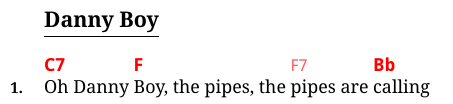
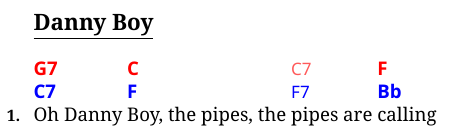
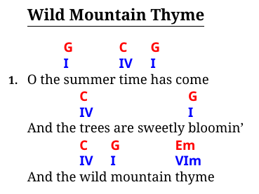

# Notation and Transposition

For the purposes of transposition, bard supports these four notation systems:

- [English](https://en.wikipedia.org/wiki/Musical_note#12-tone_chromatic_scale)
- [German](https://en.wikipedia.org/wiki/Musical_note#12-tone_chromatic_scale)
- [Nashville](https://en.wikipedia.org/wiki/Nashville_Number_System)
- Roman (the same as Nashville except using roman numerals)

The English notation is the default.
If you live in, for example, central Europe or Scandinavia, you may want to set `notation = "german"` in your `bard.toml`.

However, if you don't use transposition features, you don't need to worry about this at all, bard will simply use
whatever you enter as chords. Correct notation setting is only needed when using transposition so that bard can actually
understand chords you are using.

### Transposition

To transpose your chords, use the `!±X` syntax, where X is the number of halftones.
The chords will be transposed from that point onwards. For example:

```Markdown
# Danny Boy

!+5

1. `G7`Oh Danny `C`Boy, the pipes, the ``C7``pipes are `F`calling
```

will render as:



Use `!+0` to go back to the original.

### Second Set of Chords

To make it possible to print songs with two different scales, you can also generate a second line of chords
as a transposition of the first one. Use the `!!±X` syntax to generate a second row. The second row is by default
rendered in blue font. For example:


```Markdown
# Danny Boy

!!+5

1. `G7`Oh Danny `C`Boy, the pipes, the ``C7``pipes are `F`calling
```

renders as:



### Notation Conversion

Besides transposition, notation of chords can also be converted using the `!notation` syntax,
where `notation` is one of the names of notations listed above, in lower case.
This can be used just like transposition (and together with it) as well as for the second line of chords.

A comprehensive example of transposition and notation conversion to generate a "scale agnostic" second line:

```Markdown
# Wild Mountain Thyme

!!-7
!!roman

1. O the `G`summer `C`time `G`has come
And the `C`trees are sweetly `G`bloomin'
And the `C`wild `G`mountain `Em`thyme
```


