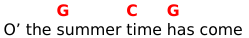

# bard Makrdown

_bard_ uses a subset of the Markdown language.

The meaning of Markdown elements in _bard_ is similar (but not always the same)
to their regular meaning. Compared to Markdown, there are a few differences:

- Inline code spans are interpreted as chords.
- All line breaks are considered hard breaks.
- Nested lists are not supported.
- Rich text elements, such as bold, italics, links, and images
  are supported in verse content, but not in headings or bullet lists.

## Songs

A song is started by a H1 heading containing the song name
and contains all the content until either the next H1 heading or end of file.

For example:

```Markdown
# Wild Mountain Thyme
```

A line starting with a single `#` is a H1 heading.
The heading text is the name of the song and as such will appear at the top of the song
and in the song index.

The song title may be followed by one or several subtitles using the H2 heading:

```Markdown
## Irish & Scottish traditional
```

These are additional titles or descriptors which appear underneath the title in a smaller font.
They may be used to describe genres, authorship, alternate titles, and similar.

Note: Only H2 headings following right after the H1 are recognized.
If there are more mixed in with the song content, they are ignored.

## Verses

The song content is made up of verses.
There are three kinds of verses:
- Regular (numbered) verses
- Choruses
- Verses with custom labels

Regular numbered verses are written using an ordered list.
Choruses are written using blockquote blocks, ie. with the `>` prefix.
(If there are multiple choruses in a song, use `>>` for the 2nd one, `>>>` for the 3rd etc.)
Custom labels are written using H3 headings, for example `### Br.`.

For example:

```Markdown
1. Verse one lyrics...

> Chorus lyrics...

2. Verse two lyrics...

### Bridge
Bridge lyrics...

3. Final verse lyrics...
```

For choruses, the label from the `chorus_label` field in `bard.toml`/`book` is used, to which
chorus number and a dot is appended. By default chorus label is `"Ch"`.
If there is only one chorus in a song, no number is added and simply `"Ch."` is used (or whatever is set in `chorus_label`).
Choruses may be referenced from verse text, see below.

*bard* automatically maintains correct numerical order of numbered verses throughout each song,
ie. you can use `1.` for all the numbered verses and they will still be numbered correctly in the output.

Note: Nested list as well as blockqutes nested within lists or vice versa are not supported.

## Lyrics with chords

Chords are written within lyrics as inline code elements, ie. they are delimited by the backtick character.
For example:

```Markdown
Oh the `G`summer `C`time `G`has come
```
Here we see the chords `G`, `C`, and back to `C` within the song lyrics.
The example above will render as:



Each chord is placed right above the text that follows, without truncating any spaces.
If a space follows a chord, the chord will be placed over that space (which is usefull when, for example,
lyrics are supposed to start in the middle of a bar).
Chords may be inserted anywhere, including middle of a word or end of line.

Chords may be transposed and there also may be a second line of chords generated
from the first line by tansposition or notation conversion (see the [Transposition doc](./transposition.md)).

In Markdown, there may be more than one backtick charater sorrounding the inline, ie. for example ` ``G`` `.
*bard* passes the number of backticks used to the templates.
By default multiple backticks are used for chords considered optional, ie. for additional musical effect or for advanced players.
They are rendered slightly smaller and in non-bold font.

## Referencing choruses

Additionally, *bard* defines a *chorus reference* inline element, this is as an extension to Markdown.  
The syntax is an `!` followed by the same number of `>` characters as in the chorus definition.
For example:

```Markdown
Will ye go lassie go? !>
```

... the `!>` at the end will be recognized as a reference to the chorus
and will be replaced by the `chorus_label` in the final render.
Some output formats, such as Hovorka XML, instead use this information to insert chorus references specific to that format.

## Rich text

Formatting such as _emphasized_ or **bold** text is supported, but only in verse text,
not in other parts of the song (such as titles, subtitles, bullet lists, etc.).
Hyperlinks are supported but rich text inside hyperlinks is not (the content is treated as plaintext).

HTML entities are supported as well, even when rendering non-HTML formats (TeX).
For example, you can use `&nbsp;` to force extra spaces or empty lines.

Some output formats (Hovorka XML) don't support rich text and simply render it as plain text.

## Images

Inserting images is supported in HTML and TeX.
Images are expected to be placed in the `output` folder, where they can be referenced by the template files.
In Markdown, this is the syntax for images:

```Markdown

```

The `title` is optional and usually is not present.
*bard* treats the `title` as a `class` instead and uses it for layout hints.
The default templates (both HTML and TeX) recognize three classes:

- None, eg. ``: Image is inserted as an inline into the text.
- `"center"`, eg. ``: Image will be centered on the pages with blank space on each side.
- `"right"`, eg. ``: Image will be placed floating on the right side of the current paragraph, approximately on the same level as the current line.

To display images properly, TeX templates need a DPI setting, which is provided in the `output` section, eg:

```toml
[[output]]
# ...
dpi = 144
# ...
```

If there's no DPI setting, a default value of 144 is assumed.
You can use the `dpi` setting to tweak the ratio of image size between HTML and TeX.
If the images are, for example, sized appropriately in HTML but appear too large in PDF, odds are the `dpi` value
needs to be increased for the TeX/PDF output. The image files themselves also may contain DPI setting as metadata,
this may influence their size in PDF as well.

Please don't expect too much from the image layout. It's meant to be fairly basic.
Chances are it won't work great in some situations.

## Bullet lists

*bard* supports unordered bullet lists, they may be used for additional comments or metadata
to the song, eg.

```Markdown
- Genre: Folk
- Origin: Ireland, 19th century
```

## Miscellaneous

Preformatted (ie. monospace, code) text blocks are supported,
they may be used for tabs, etc. For example:

````Markdown
```
e|-----------------------5-7--5----------------------|
B|---3-5-7--3-5-7-3----7--------7-5-3-7----3-7-5---3-|
G|-2----------------2--------------------2-----------|
D|---------------------------------------------------|
A|---------------------------------------------------|
E|---------------------------------------------------|
```
````

Horizontal lines (aka. horizontal rules or thmeatic breaks) are also supported, ie.

```Markdown
---
```
