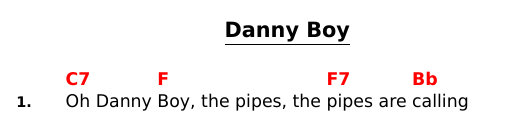
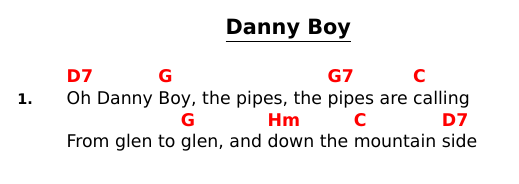
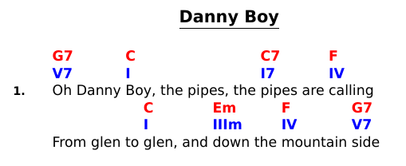

# Transposition and notation conversion

To transpose chords, use a _bard_ Markdown extension with the syntax of `!+X`
where `+X` is a number of halftones (may also be negative).
This is an inline element and may be placed anywhere in song lyrics,
it's effect applies from that place onwards.
For example:

```Markdown
# Danny Boy

!+5

1. `G7`Oh Danny `C`Boy, the pipes, the `C7`pipes are `F`calling
```

... will be rendered as:



Besides transposition, it's also possible to convert source [musical notation](https://en.wikipedia.org/wiki/Musical_note#12-tone_chromatic_scale) to another notation.
_bard_ recognizes four notation types:

- `english` (aka `western` and `dutch`)
- `german` (aka `czech`)
- `nashville` - ie. numbered
- `roman` - the same as `nashville`, but roman numerals are used

The syntax to convert notation is `!notation`, for example:

```Markdown
# Danny Boy

!-5
!czech

1. `G7`Oh Danny `C`Boy, the pipes, the `C7`pipes are `F`calling
From glen to `C`glen, and `Em`down the `F`mountain `G7`side
```

... this will become:



Finally, _bard_ also supports generation of second row of chords by transposing or converting source chords.
The syntax for this is the same, except with double exclamation mark. For example:

```Markdown
# Danny Boy

!!roman

1. `G7`Oh Danny `C`Boy, the pipes, the `C7`pipes are `F`calling
From glen to `C`glen, and `Em`down the `F`mountain `G7`side
```

... renders as:


